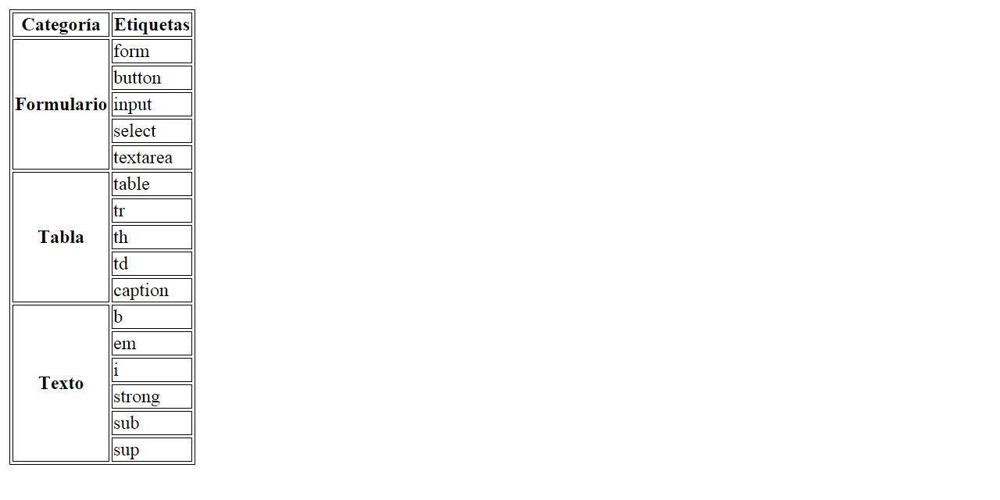

# EJERCICIO HTML 10: Vamos a crear tablas!

En este ejercicio vamos a crear una tabla que a su vez os va a ayudar a repasar el contenido anterior. Todo en uno!!

Esta vez no hay requerimientos, os vamos a dejar con lo que esperamos que se visualice una vez terminéis el ejercicio. Lo único es que, como no hemos visto aún CSS, os vamos a dejar un <style> con los estilos en línea que hemos puesto en la tabla... pero sois libres de cambiarlos por los que os gusten!

